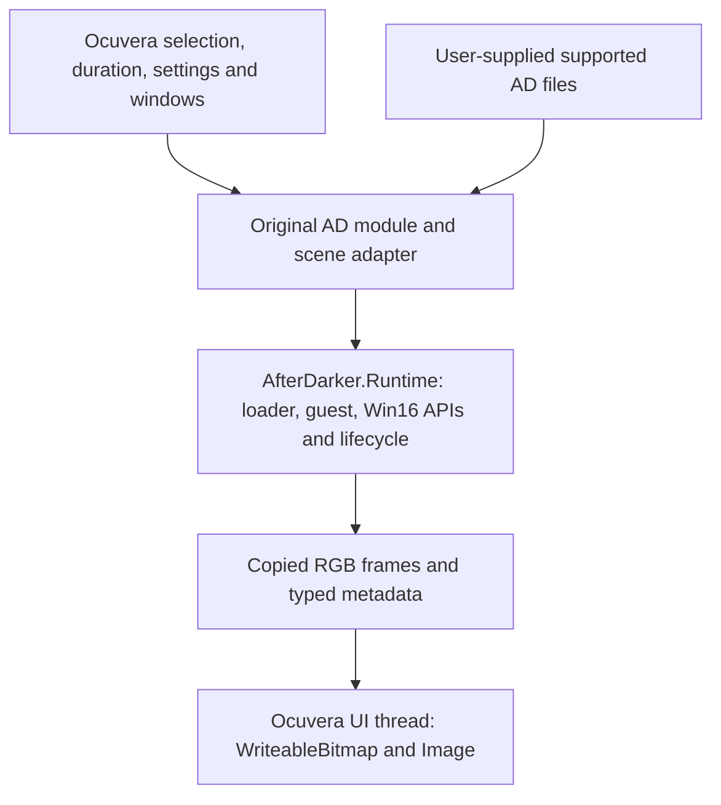

# Hosting original AD modules in Ocuvera Toasters

Assessment date: 2026-09-20. Source snapshots: After Darker `ddd273c` (Shapes
merged) and Ocuvera Toasters `db2e78e` (`stained glass`). Both working trees were
clean on `main` when inspected. Ocuvera was inspected locally without changes.

**Conclusion:** the architecture already fits. The substantial remaining work
is packaging native execution and integrating lifecycle management, rather
than rewriting emulation or drawing. The owner controls both projects and
explicitly allows changes to Ocuvera's scene interfaces; existing native scenes
can implement new runtime hooks as no-ops where appropriate.

This document is a source-based assessment and implementation proposal. No
NuGet package, Ocuvera integration, multi-monitor run or published `.scr` runtime
test was performed for this assessment. Existing After Darker execution evidence
is recorded in [current status](current-status.md); it does not establish those
new delivery scenarios.

## Responsibility boundary

Ocuvera owns which screensaver runs, for how long, where its windows appear and
when user input ends the application. After Darker owns the guest machine,
module lifecycle, Win16 behavior, drawing surface and guest pacing. A generic
adapter connects those responsibilities. Each supported original module gets
its own catalog entry, but uses the same adapter implementation.

The existing tutorial and standalone WPF player remain valuable consumers of
the library. Neither should become an obligatory dependency of Ocuvera.

## What already matches

| Concern | Current source evidence | Consequence |
| --- | --- | --- |
| Managed platform | Ocuvera targets `net10.0-windows`; Core and Runtime target `net10.0` | No framework migration is needed for this consumer. Native execution currently targets Windows x64. |
| Module selection | Ocuvera's `IScreensaverModule` supplies identity, duration, monitor mode and `CreateScene` | Register originals as ordinary catalog entries so the existing random selector and enable/disable settings can include them. |
| Scene presentation | `IScreensaverScene` exposes attach, detach, resize and update; Whitney places an `Image`/`WriteableBitmap` on the scene canvas | The adapter can use the same pattern. The scene interface does not impose a pixel format. |
| Reusable execution | `IAnimationSession` and `SupportedModules` are already in a separate Runtime class library | No loader or Win16 implementation needs copying into Ocuvera. |
| Background playback | `AfterDarkPlayback.RunAsync` owns sequential execution, pacing, cancellation and cleanup | Ocuvera's UI rendering callback should copy available images, not execute guest drawing calls. |
| Pixel transfer | `LatestFrameMailbox` copies packed RGB24 bytes and `FrameInfo`; our WPF player uses `PixelFormats.Rgb24` | Ocuvera can also own an RGB24 bitmap. Whitney's BGRA32 choice does not require conversion across the suite. |

Important source entry points in this repository:

- [Runtime project](../src/AfterDarker.Runtime/AfterDarker.Runtime.csproj),
  [session contract](../src/AfterDarker.Runtime/IAnimationSession.cs),
  [supported modules](../src/AfterDarker.Runtime/SupportedModules.cs).
- [Background playback](../src/AfterDarker.Runtime/AfterDarkPlayback.cs),
  [mailbox](../src/AfterDarker.Runtime/LatestFrameMailbox.cs),
  [WPF presenter/lifecycle example](../src/AfterDarker.Wpf/MainWindow.xaml.cs).
- [Session timing](../src/AfterDarker.Runtime/SessionTiming.cs),
  [playback options](../src/AfterDarker.Runtime/PlaybackOptions.cs),
  [WPF ownership guide](wpf-player.md).

In the Ocuvera checkout, inspect `screensaver/Modules/IScreensaverModule.cs`,
`IScreensaverScene.cs`, `ScreensaverSceneContext.cs`,
`ScreensaverModuleCatalog.cs`, and `Whitney/WhitneyScene.cs`; then
`screensaver/Scene/ScreensaverSceneHost.cs`, `ScreensaverManager.cs`,
`ScreensaverWindowManager.cs`, `ScreensaverInputCloser.cs`,
`screensaver/MainWindow.xaml.cs` and `screensaver/App.xaml.cs`.

## Work needed

### 1. Make the existing libraries portable packages

Start with an `AfterDarker.Runtime` NuGet package depending on an
`AfterDarker.Core` package. Keep WPF presentation in Ocuvera's adapter initially;
a shared WPF presenter library can follow if actual duplication warrants it.
Do not package the current WPF executable as the integration API.

The current Runtime project restores a pinned native Unicorn DLL into the
repository's ignored `artifacts/` directory through a PowerShell build target.
That works in this checkout, but is not a consumer deployment contract. Put the
verified Windows DLL in `runtimes/win-x64/native/unicorn.dll` in the package,
with reproducible producer-side restoration, dependency notices, XML docs and
version metadata. A consuming build should not need our repository layout or
restore script. This is the [NuGet native-asset layout](https://learn.microsoft.com/en-us/nuget/create-packages/native-files-in-net-packages).

Keep the managed binding and native DLL pinned together. Test a local-feed
package from a consumer outside this solution so project references and files
already beside the tutorial executable cannot mask missing assets.

### 2. Establish an explicit executable requirement for Unicorn

Our pinned engine has an observed CFG incompatibility in the .NET 10 host:
native `longjmp` validation failed until the generated executable was built with
CFG disabled. See [the recorded experiment](tutorials.md#dependencies-and-windows-setup)
and [upstream issue 2281](https://github.com/unicorn-engine/unicorn/issues/2281).
This affects the process hosting Unicorn, not just the After Darker assembly.

The current `configure-tutorial-apphost.ps1` intentionally accepts only named
After Darker outputs in this checkout. A package cannot reuse that restriction
unchanged, or silently broaden it to arbitrary consumers. Define and test an
explicit consumer build opt-in, scoped to generated application outputs, if we
retain this engine/workaround. Account for the current `editbin` build-tool
requirement. Never modify the shared .NET host or global Windows settings.

Ocuvera's `SingleFileScr.pubxml` already requests Windows x64, self-contained
single-file output and `IncludeNativeLibrariesForSelfExtract=true`. .NET can
bundle native libraries with that setting and extract them before loading;
the deployed runtime can remain one `.scr` while original AD files remain
external. See [.NET single-file deployment](https://learn.microsoft.com/en-us/dotnet/core/deploying/single-file/overview#native-libraries).

Prove native resolution and CFG configuration in both development output and
the actual published `.scr`. Ocuvera copies the generated `.exe` to `.scr` in
build/publish targets, so target ordering must preserve the intended settings
in the final file, before any signing. A working project reference alone does
not prove this. If changing the full host's CFG setting is unsuitable, an
isolated worker executable is an alternative with additional IPC/deployment
work; it is not necessary to design that larger solution before this test.

### 3. Let Ocuvera await runtime shutdown

Today Ocuvera's rotation disposes windows synchronously. `MainWindow.Closed`
disposes its scene, and input handlers call `Application.Shutdown()` directly.
After Darker requests cancellation, lets a bounded active guest call finish,
then executes CLOSE/WEP at a healthy stack boundary and disposes Unicorn. A
guest fault skips guest cleanup but still releases native resources.

Add an awaitable stop/lifetime contract through Ocuvera's scene, host and
rotation/exit coordination. Existing native scenes can return a completed
`ValueTask` when no asynchronous work is necessary. Shutdown should be
idempotent and safe during startup, playing, stopping and failure. Stop
presentation and account for the old worker before starting its replacement;
input-driven application shutdown must also await worker completion. Avoid
blocking the dispatcher with synchronous waits or leaving unobserved tasks.

The adapter should expose/observe worker completion and report module faults to
the manager. The manager can exclude a failed module for that run and continue
the collection. This recovers managed playback failures; an in-process native
crash is not isolated merely because execution uses a background task.

A small public player object wrapping start, frame access, completion and
`StopAsync` would make this easier for both hosts. Its exact API is still a
design choice; preserve the simpler `IAnimationSession` for tutorials/tests.

### 4. Describe and discover supported originals

Expose typed catalog descriptors: stable ID, display name, supported artifact
identity, dimension constraints and supported/default options. Today
`SupportedModules.Identify` returns a name from a hash switch, while some
constraints live in profiles. Consumers should not replicate those switches.

Ocuvera should discover a configured external module directory, validate files,
and register available recognized modules. Missing files/unknown revisions need
diagnostics without preventing its native collection from running. Use distinct
identities such as `afterdark-shapes` / `Shapes (Original Win16)` alongside the
existing native `shapes` entry. Register each module individually for selection
and settings instead of hiding a second randomizer inside one AD entry.

The currently recognized artifacts cover Mondrian, Spiral Gyra, Rainstorm,
Fade Away, Lasers, Magic, String Theory, Zot!, Hard Rain and Shapes. Packaging
does not add support for other modules or other revisions. Their current
profile choices and limitations remain: for example, Fade Away runs Radar on
white initial pixels and eventually stays black. Desktop capture and other
styles are separate work; expose capability-specific controls only when proven.

### 5. Preserve presentation and define monitor behavior

Keep guest resolution separate from WPF viewport size. A fixed 640x480 guest
is a useful first integration setting, scaled by the presenter with an explicit
aspect-ratio policy. The current general limit is 2048 pixels per dimension,
and profiles can add minimum sizes. A 4K monitor or wide virtual desktop cannot
simply be passed through as the guest dimensions. Resizing the display need not
restart or resize the guest.

Retain the current intermediate-image mechanism: Rainstorm and Zot! draw and
erase flashes inside one guest DRAWFRAME. Copying only when DRAWFRAME returns
loses those images. The existing worker publishes checkpoints and applies the
documented short holds; the adapter should consume that stream. A latest-frame
mailbox still cannot guarantee a stalled UI sees every transient image.

Ocuvera supports independent, duplicated, virtual-desktop and primary-only
monitor modes. Independent playback needs a separate session/clock/state per
instance and measured concurrency/resource behavior. Its duplicate mode
currently creates separate scenes with equal `Random` seeds; After Darker
does not consume that `Random`. Guest seeds can come from emulated civil time,
and the high-level worker currently hardcodes `SessionTiming.Live()`. Expose
an intentional timing/seed policy rather than assuming independent sessions
automatically produce different pictures or equal seeds guarantee live lockstep.

For truly identical mirrored output, one playback worker can feed multiple
presenters through deliberate fan-out. Do not attach several consumers directly
to `LatestFrameMailbox`: reading consumes the pending frame. Start acceptance
with one display, then verify the chosen multi-monitor policy explicitly.

## Delivery milestones and proof

1. **Independent package/deployment proof:** pack Core/Runtime to a local feed;
   restore a small Windows x64 host outside this repository; execute a
   source-owned guest fixture through the packaged native engine. Verify both
   ordinary apphost and Ocuvera-style single-file `.scr` output. Resolve the
   executable/CFG requirement here before building a larger host API.
2. **One original in the real collection:** add a generic adapter and awaitable
   scene shutdown; show original Shapes at 640x480 on one display, rotate to
   Whitney and back, then stop through the normal input path. Verify worker and
   guest resource cleanup. Keep originals distinct from native recreations.
3. **Collection readiness:** discover all available supported originals; verify
   selection/settings, repeated rotation, missing/invalid files, initialization
   and playback failures, cancellation during startup/drawing, lightning
   presentation, and the selected monitor/seed policy. Soak-test CPU, memory and
   handles over many rotations, then repeat in the final published artifact.

Public tests should use generated/source-owned fixtures and fake playback
workers for lifecycle tests. Real AD acceptance remains opt-in and local. Do
not include modules, private captures or developer-local paths in package
contents. Preserve the educational console and standalone WPF regression checks.

Before distributing packages, choose After Darker's currently undecided project
license and record dependency redistribution terms/notices. The pinned Unicorn
release declares [GPLv2](https://github.com/unicorn-engine/unicorn/blob/2.1.3/COPYING);
ownership of both application repositories does not remove third-party terms.
This is a distribution task distinct from proving the local integration.

The durable model is: **Ocuvera chooses and presents; After Darker executes;
the adapter manages their shared lifetime and transfers images.** Future module
support should usually arrive through an updated runtime package and catalog,
without a new Ocuvera drawing implementation.
