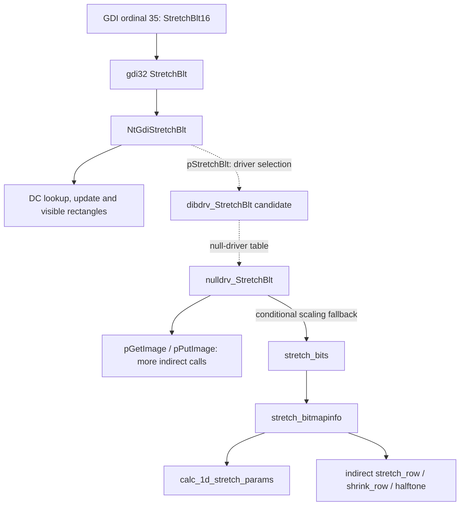

# Mapping Wine dependencies before choosing what to port

Original assessment: 2026-09-22. This page preserves the tool selection and
manually inspected source sample. **The automated CodeQL analysis is now
available:** see [the 2026-09-25 graph results](wine-dependency-graph-results.md)
for the queryable dataset, actual coverage, findings and limitations. Neither
study changed the compatibility implementation or established a suite-wide
port estimate.

## Question and intended result

For each API needed by our original AD modules, which Wine functions, data
structures and runtime services would a C# adaptation actually need?

Produce two connected views:

1. The source dependency graph: what the selected Wine implementation can call
   or access, including unresolved indirect calls.
2. The proposed adaptation graph: what we would port, connect to existing
   After Darker services, or omit under an explicit supported configuration.

A reachable Wine function is not automatically another C# function to write.
Conversely, an unresolved function pointer is not a leaf with no dependencies.
Sharing one helper across ten API roots should count once in the total.

## Existing starting points

- [Import census](ad-import-census.md) and [CSV](ad-imports.csv): the original
  29-artifact collection has 129 distinct KERNEL/USER/GDI import targets,
  including an imported constant. These are historical static facts, not 129
  missing functions or a count of runtime-exercised APIs.
- [Expanded collection audit](windows98-readiness-audit.json): 65 module hashes,
  with loader failures and unsupported imports at the time of that audit.
  Refresh against the current registry; Puzzle support postdates the audit.
- [Current registry](../../src/AfterDarker.Core/Win16/Win16Imports.cs): symbolic
  bindings and implemented/unsupported handlers. An implemented handler may
  still guard unimplemented argument combinations.
- Include recovered helper DLLs in the import inventory. A module's direct
  imports do not include the entire dependency chain through AD_RSRC or WIN87EM.
  Wine is not the source of proprietary AD helper implementations.

Map module plus ordinal/name through the matching Wine `.spec` export table.
Do not match by name alone or count constant exports as callable roots.

## Tool assessment

**CodeQL is the recommended first semantic-analysis pilot.** Its C/C++ model
provides functions, calls, arguments and data-flow queries. Its `resolveCall`
library also attempts function-pointer target resolution. That is valuable for
Wine's driver tables, but must not be treated as exhaustive resolution.

- [Functions and direct calls](https://codeql.github.com/docs/codeql-language-guides/functions-in-cpp/)
- [Function-pointer resolution](https://codeql.github.com/codeql-standard-libraries/cpp/semmle/code/cpp/ir/dataflow/ResolveCall.qll/predicate.ResolveCall%24resolveCall.1.html)

**Clang/LibTooling is an alternative**, especially for a purpose-built extractor
of call sites, field accesses and source locations. Clang's built-in
`debug.DumpCallGraph` is useful for initial inspection, but its translation-unit
graph is not by itself a complete linked Wine graph. A reproducible analysis
needs the actual include paths, generated headers, definitions and compilation
configuration; Clang tooling supports a compilation database for this purpose.

- [Clang call-graph debugging](https://clang.llvm.org/docs/analyzer/developer-docs/DebugChecks.html)
- [Compilation database](https://clang.llvm.org/docs/JSONCompilationDatabase.html)

**Doxygen plus Graphviz or GNU cflow** can provide a quicker navigable overview.
Doxygen explicitly warns that its parser's graphs are not necessarily complete
or correct. Use these for browsing, not as the evidence that no hidden runtime
dependencies remain.

- [Doxygen graphs](https://www.doxygen.nl/manual/diagrams.html)
- [Doxygen completeness caveat](https://www.doxygen.nl/manual/commands.html#cmdcallgraph)
- [GNU cflow](https://www.gnu.org/software/cflow/)

None of these tools was run against Wine in the original September 22 assessment. They were not
found on this session's PATH; that is not an exhaustive installation search.
Do not introduce an analyzer as a playback dependency. First prove extraction
and indirect-edge reporting on a small slice before investing in a full index.

## Concrete source sample: StretchBlt

Inspected upstream Wine revision
`4f4d68f6a784db76e66cf0f033f90b8288bba11e`. Five reference files and the revision
identifier are retained locally under ignored `artifacts/wine-source-survey/`.
This is upstream Wine's source, not a trace of WineVDM executing Windows GDI.

The following is a **partial source map**. Dotted edges cross driver dispatch
boundaries whose concrete registration/selection still needs resolution.
Side branches and many helpers are omitted; it is not a transitive closure.

Source anchors:

- [Win16 export contract](https://github.com/wine-mirror/wine/blob/4f4d68f6a784db76e66cf0f033f90b8288bba11e/dlls/gdi.exe16/gdi.exe16.spec#L35)
  and [thin wrapper](https://github.com/wine-mirror/wine/blob/4f4d68f6a784db76e66cf0f033f90b8288bba11e/dlls/gdi.exe16/gdi.c#L786).
- [GDI32 wrapper](https://github.com/wine-mirror/wine/blob/4f4d68f6a784db76e66cf0f033f90b8288bba11e/dlls/gdi32/dc.c#L1961)
  includes metafile and printing branches before ordinary drawing.
- [NtGdiStretchBlt](https://github.com/wine-mirror/wine/blob/4f4d68f6a784db76e66cf0f033f90b8288bba11e/dlls/win32u/bitblt.c#L587)
  reads DC state, calculates visible rectangles and invokes `pStretchBlt`.
- [Null-driver implementation](https://github.com/wine-mirror/wine/blob/4f4d68f6a784db76e66cf0f033f90b8288bba11e/dlls/win32u/bitblt.c#L277)
  gets/puts images, conditionally converts formats and falls back to scaling.
- [Buffer allocation wrapper](https://github.com/wine-mirror/wine/blob/4f4d68f6a784db76e66cf0f033f90b8288bba11e/dlls/win32u/bitblt.c#L194)
  calls the scaler and transfers buffer ownership with a freeing callback.
- [Scaling algorithm](https://github.com/wine-mirror/wine/blob/4f4d68f6a784db76e66cf0f033f90b8288bba11e/dlls/win32u/dibdrv/bitblt.c#L1201)
  takes bitmap descriptions and pixel buffers, calculates sampling parameters,
  and dispatches to pixel-format-specific row operations.

**Inference:** the buffer-oriented scaling routines are plausible adaptation
points for our existing surfaces. This does not prove they are self-contained
or sufficient: row implementations, clipping, mirroring, overlap, format
conversion and raster operations still need examination and conformance tests.
The visible layering does establish that porting the Win16 wrapper alone would
not supply the algorithm, while porting all Wine DC machinery is not the only
possible approach.

## What the full analysis should record

For each function, retain its qualified identity, source revision/file/line,
direct callees, candidate indirect callees, unresolved call sites, accessed
state/types, allocation/free behavior, callbacks and external API boundaries.
Record macro/inline behavior too: a handle conversion or field access need not
appear as a callable node after preprocessing.

Label dependencies as candidates to:

- port as an algorithm;
- adapt to existing guest memory, handles, DCs or surfaces;
- reuse through a separately justified native boundary;
- exclude under a documented host invariant;
- investigate because the target, semantics or ownership is unresolved.

An exclusion needs a reason. For example, supplying only bitmap-backed drawing
contexts could make printer/metafile paths unnecessary; merely not seeing them
in one trace does not establish that invariant. Likewise, optional grayscale
can be excluded, but monochrome masks used in color animation may still matter.

Report counts of unique functions, shared helpers, stateful subsystems,
unresolved edges and external boundaries. Source size is supporting evidence,
not a conversion from lines of C to hours of work. Scope every result to the
chosen source/build configuration and report parsing/extraction failures.

Overlay observed module API traces and arguments to prioritize reachable
branches. Keep imported, statically reachable and dynamically observed separate.
Unseen code remains possible until a host invariant or path analysis rules it
out. WineVDM traces can show the module's API requests; Windows GDI execution
does not reveal upstream Wine's internal raster path.

## Bounded first pilot

Use one already-understood rectangle API to validate graph extraction, then
StretchBlt for indirect rendering dependencies and a palette family for shared
state. Refresh root candidates from the current module/helper census before
claiming coverage of the collection. The pilot succeeds when each sampled API
has a source-linked graph, explicit unresolved edges, a proposed adaptation
boundary and a comparison with existing After Darker responsibilities.

This is a research milestone, not authorization to replace the production
renderer or begin a broad Wine port. No precise suite-wide function count or
completion-time estimate has been established yet.
